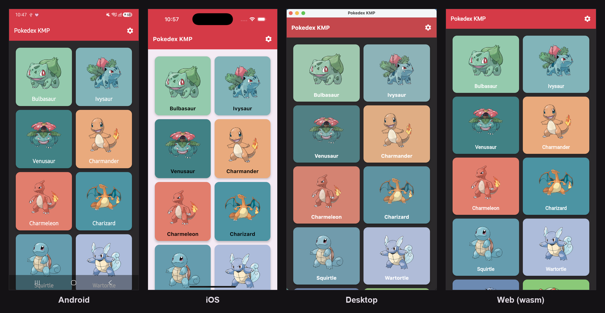
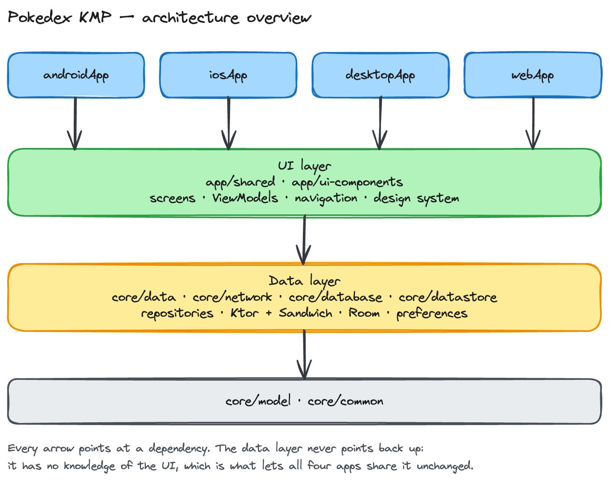
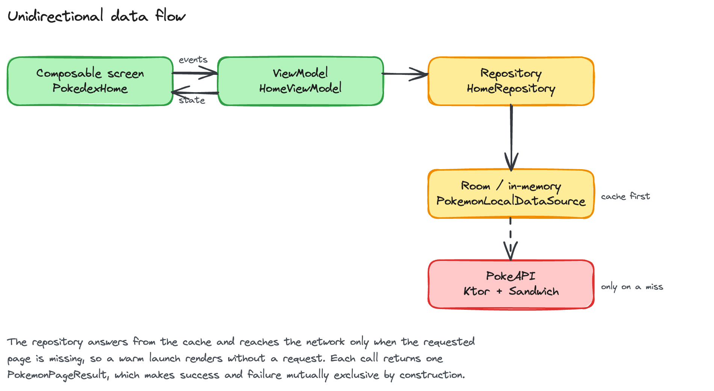
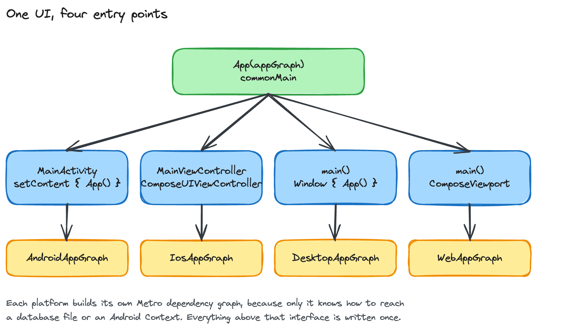
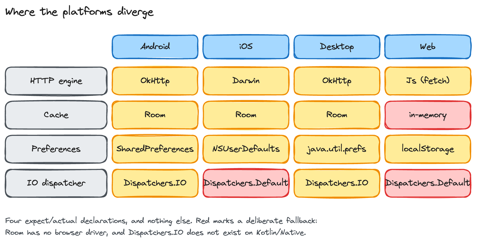
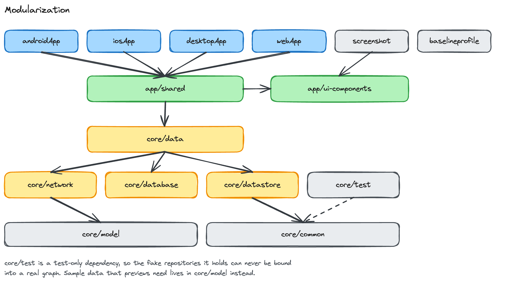

<h1 align="center">Pokedex KMP</h1>

<p align="center">
  <a href="https://opensource.org/licenses/Apache-2.0"></a>
  <a href="https://android-arsenal.com/api?level=24"></a>
  <a href="https://github.com/skydoves/pokedex-kmp/actions"></a>
  <a href="https://github.com/skydoves"></a>
  <a href="https://github.com/doveletter"></a>
</p>

<p align="center">  
🗡️ Pokedex KMP demonstrates modern Kotlin Multiplatform development with Compose Multiplatform, Metro, Ktor, Sandwich, Room, and Landscapist, running from one shared codebase on Android, iOS, desktop, and the web.
</p>

> [!NOTE]
> This project is the Kotlin Multiplatform sibling of [Pokedex](https://github.com/skydoves/pokedex) and [Pokedex Compose](https://github.com/skydoves/pokedex-compose), which are featured in the official Android documentation on [Hero benchmarks](https://developer.android.com/develop/ui/compose/performance/herobenchmark).

> [!TIP]
> If you want the Android only versions, check out [Pokedex Compose](https://github.com/skydoves/pokedex-compose) for Jetpack Compose or [Pokedex](https://github.com/skydoves/pokedex) for XML.

<p align="center">

</p>

## Download

Go to the [Releases](https://github.com/skydoves/pokedex-kmp/releases) to download the latest APK.

## Platforms

The same screens, ViewModels, navigation, and data layer produce four applications:

| Platform | Module | Run |
|---|---|---|
| Android | `app/androidApp` | `./gradlew :app:androidApp:installDebug` |
| iOS | `app/iosApp` | open `app/iosApp/PokedexKmp.xcodeproj` in Xcode |
| Desktop | `app/desktopApp` | `./gradlew :app:desktopApp:run` |
| Web (wasm) | `app/webApp` | `./gradlew :app:webApp:wasmJsBrowserDevelopmentRun` |

The iOS project is generated from `app/iosApp/project.yml` with [XcodeGen](https://github.com/yonaskolb/XcodeGen), and its "Compile Kotlin" build phase runs `:app:shared:embedAndSignAppleFrameworkForXcode`.

## Tech stack & Open-source libraries

- [Kotlin Multiplatform](https://kotlinlang.org/docs/multiplatform.html) with [Compose Multiplatform](https://www.jetbrains.com/compose-multiplatform/), targeting Android, iOS, desktop (JVM), and wasmJs.
- [Coroutines](https://github.com/Kotlin/kotlinx.coroutines) + [Flow](https://kotlin.github.io/kotlinx.coroutines/kotlinx-coroutines-core/kotlinx.coroutines.flow/) for asynchronous work.
- [Metro](https://github.com/ZacSweers/metro): compile time dependency injection for Kotlin Multiplatform. One graph per platform, all bindings resolved at compile time.
- [Ktor](https://ktor.io/): the HTTP client, with the engine each platform ships (OkHttp, Darwin, and the browser fetch API).
- [Sandwich](https://github.com/skydoves/sandwich): models the network response as `ApiResponse`, so success, an HTTP error, and a transport failure are three branches rather than a thrown exception.
- [Room](https://developer.android.com/kotlin/multiplatform/room) 3: the offline first cache on Android, iOS, and desktop, backed by the bundled SQLite driver.
- [Landscapist](https://github.com/skydoves/landscapist): image loading, backed by Coil 3 on every target.
- [Cloudy](https://github.com/skydoves/cloudy): the blur behind the details header.
- [Multiplatform Settings](https://github.com/russhwolf/multiplatform-settings): theme persistence across SharedPreferences, NSUserDefaults, java.util.prefs, and localStorage.
- [Compose Navigation Graph](https://github.com/skydoves/compose-nav-graph): extracts the navigation graph at compile time and renders every destination without an emulator. `navCheck` fails the build when a destination or transition changes without review.
- [Compose Stability Analyzer](https://github.com/skydoves/compose-stability-analyzer): reports composable stability and tracks it against a committed reference.
- [Compose HotSwan](https://hotswan.dev/): captures every `@Preview` from the running app and publishes the catalog to GitHub Pages.
- [Paparazzi](https://github.com/cashapp/paparazzi): device spec golden images for the design system, rendered without a device.
- [Baseline Profiles](https://developer.android.com/topic/performance/baselineprofiles/overview): generated on a Gradle managed device from the real user journey.
- [Turbine](https://github.com/cashapp/turbine): testing library for `Flow`.
- [kotlinx.serialization](https://github.com/Kotlin/kotlinx.serialization) for JSON, and [KSP](https://github.com/google/ksp) for Room and the navigation graph.

## Architecture

**Pokedex KMP** follows the same layering as [Google's official architecture guidance](https://developer.android.com/topic/architecture), expressed once in common code.



The architecture is split into a UI layer and a data layer. Each layer has its own responsibilities, and the dependency only ever points downward: the data layer knows nothing about the UI, which is what lets all four applications share it unchanged.

### Unidirectional data flow



The UI layer sends events down and receives state back up. The data layer exposes results as a stream and never calls into the UI.

Each request returns exactly one `PokemonPageResult`, which is either a success carrying the accumulated list or a failure carrying a message. Modelling it as one value rather than as separate callbacks is deliberate. An earlier version reported progress through `onStart`, `onComplete`, and `onError` callbacks, and because completion always fires after the error, the error state was overwritten before any collector could observe it. The screen showed a spinner that never resolved. One return value makes success and failure mutually exclusive by construction.

### Offline first

The cache is the single source of truth. The repository reads it first and reaches the network only when the requested page is missing, so a warm launch renders without a request. A page is only marked as loaded once it actually arrives, which means a failed page is retried rather than skipped.

### One UI, four entry points



Every platform renders the same `App(appGraph)` composable. What differs is how it is hosted and how its dependency graph is built, because only the platform knows how to reach a database file or an Android `Context`.

### Where the platforms diverge



The shared code contains four `expect`/`actual` declarations, and nothing more. Two of them are deliberate fallbacks: Room publishes no browser driver, so the web build keeps its cache in memory for the session, and `Dispatchers.IO` does not exist on Kotlin/Native, so Apple targets use the default worker pool.

One more place worth calling out is colour extraction. The cards are tinted with the dominant colour of each sprite, and the palette libraries available resolve to a different quantizer per platform, which made the same Pokémon render green on Android and pink on iOS. The quantizer therefore lives in common code, so all four targets agree by construction.

## Modularization



**Pokedex KMP** adopted modularization strategies below:

- **Reusability**: Modulizing reusable codes properly enable opportunities for code sharing and limits code accessibility in other modules at the same time.
- **Parallel Building**: Each module can be run in parallel and it reduces the build time.
- **Strict visibility control**: Modules restrict to expose dedicated components and access to other layers, so it prevents they're being used outside the module.
- **Decentralized focusing**: Each developer team can assign their dedicated module and they can focus on their own modules.

For more information, check out the [Guide to Android app modularization](https://developer.android.com/topic/modularization).

## Testing

```bash
./gradlew desktopTest testAndroidHostTest wasmJsBrowserTest   # unit tests, every target
./gradlew :app:screenshot:verifyPaparazziDebug                # golden images
./gradlew :app:shared:navCheck                                # navigation graph baseline
```

The common test sources run on all four targets, so the same assertions are verified against the JVM, ART, Kotlin/Native, and wasm.

Paparazzi covers components that render purely from their inputs. Whole screens are captured instead by Compose HotSwan, which photographs each `@Preview` inside the running app on a device, where Compose Multiplatform resources and network images both behave normally.

## Preview gallery

Every `@Preview` is captured on an emulator by the `Preview Gallery` workflow and published to GitHub Pages:

```bash
./gradlew -Photswan.enabled=true :app:androidApp:captureAllPreviews
```

HotSwan is opt in because its compiler plugin rewrites Compose call sites, which conflicts with the headless renderer that compose-nav-graph uses. Ordinary builds and the navigation graph compile clean bytecode, and the capture job turns it on for the one task that needs it.

## Baseline profiles

```bash
./gradlew :app:androidApp:generateReleaseBaselineProfile
```

The profile is collected on the `pixel6api31` Gradle managed device by walking the real journey: land on the grid, scroll it, open a Pokémon, wait for the details to settle. The generated `baseline-prof.txt` and `startup-prof.txt` are committed under `app/androidApp/src/release/generated/baselineProfiles/`.

## Books & Learnings

<a href="https://howcomposeworks.com/">

</a>

### 📗 Jetpack Compose Mechanisms Book

[Jetpack Compose Mechanisms](https://howcomposeworks.com/) takes you from "how to use Compose" into "how Compose actually works," tracing the AOSP source line by line through the compiler, runtime, and UI layers beneath every Composable, with practical, production-ready examples from the author's own Compose tooling and libraries. It then ties all three layers together into deep, real-world performance tuning, from stability inference to the skip decision. Fully updated for Kotlin 2.4.0 and Compose Compiler 2.4.0. [The Course: Jetpack Compose Mechanisms](https://doveletter.dev/course/compose) with 120+ practical questions with full answers and 240+ interactive assessments, +880 PDF page equivalents will enhance your Compose internals skills, and you can claim the certificate at the end.

<a href="https://android.skydoves.me/">

</a>

### 📘 Manifest Android Interview Book & Course

[Manifest Android Interview](https://www.android.skydoves.me/) is a comprehensive guide designed to enhance your Android development expertise through 108 interview questions with detailed answers, 162 additional practical questions, and 50+ "Pro Tips for Mastery" sections. The interview questions primarily focus on Android development—including the Framework, UI, Jetpack Libraries, and Business Logic, as well as Jetpack Compose, covering Fundamentals, Runtime, and UI. The [Course - Manifest Android Interview](https://leanpub.com/c/manifest-android-interview-courses) with over 250 quiz questions, 370 practical and follow-up questions with full answers, and 60+ pro tips, this course helps you sharpen skills, understand the why, and prepare for real-world technical challenges for Android & Compose; it challenges you to prove you've mastered it and earn a certificate.

<a href="https://kotlin-deepdive.com/">

</a>

### 📙 Practical Kotlin Deep Dive Book & Course

[Practical Kotlin Deep Dive](https://kotlin-deepdive.com/) takes you from “how to use Kotlin” into “how Kotlin really works,” revealing the internal implementations, desmifying bytecodes and compiler behavior, and internals that shape the language. If you want to write smarter, more confident Kotlin across fundamentals, coroutines, and multiplatform, this is the book that shows you why everything is the way it is. The [Course - Practical Kotlin Deep Dive](https://leanpub.com/c/leanpub/kotlin-deep-dive-courses), with 158 interactive assessments to test and reinforce your understanding, this course doesn't just show you why everything is the way it is; it challenges you to prove you've mastered it and earn a certificate.


## Open API


Pokedex KMP using the [PokeAPI](https://pokeapi.co/) for constructing RESTful API.<br>
PokeAPI provides a RESTful API interface to highly detailed objects built from thousands of lines of data related to Pokémon.

## Find this repository useful? :heart:
Support it by joining __[stargazers](https://github.com/skydoves/pokedex-kmp/stargazers)__ for this repository. :star: <br>
Also, __[follow me](https://github.com/skydoves)__ on GitHub for my next creations! 🤩

# License
```xml
Designed and developed by 2026 skydoves (Jaewoong Eum)

Licensed under the Apache License, Version 2.0 (the "License");
you may not use this file except in compliance with the License.
You may obtain a copy of the License at

   http://www.apache.org/licenses/LICENSE-2.0

Unless required by applicable law or agreed to in writing, software
distributed under the License is distributed on an "AS IS" BASIS,
WITHOUT WARRANTIES OR CONDITIONS OF ANY KIND, either express or implied.
See the License for the specific language governing permissions and
limitations under the License.
```
